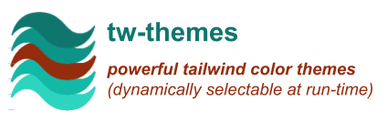

# tw-themes

<p style="text-align: left;">
  
</p>

Developing **color themes** _that are dynamically selectable
at run-time_ is **a tedious and arduous process**.  Ideally **Dark
Mode** would also be included in our requirements list!  While
**tailwind** provides a powerful foundation to work from, it has no
real support for the dynamics that are needed for this task.

If you are a **tailwind** user _that needs **dynamic color themes**_,
this utility may be just what you are looking for!

<!--- Badges ---> 
[](https://www.npmjs.com/package/tw-themes)

<!--- *** Section ************************************************************************* ---> 
## Introduction

<ul><!--- indentation hack for github - other attempts with style is stripped (be careful with number bullets) ---> 

**tw-themes** is a [tailwindcss] utility that facilitates _**dynamic
color themes that are selectable at run-time**_.

Using **tw-themes** ...

- You define and use [Context Colors].  These are
  _abstract colors that have meaning in the context of your
  application_.  You define them however you wish _(such as `primary`
  and `secondary`)_, and reference them throughout your markup with
  **tailwind**'s standard color syntax _(ex: `text-primary`,
  `bg-secondary-400`, etc.)_.

- You then map **Real Colors** to your **Context Colors** through one
  or more [Themes], which can be selected at run-time to
  **change your application colors on the fly!**

  Your colors can be defined either through the **tailwind**'s
  standard color pallet, or your own custom colors _(or a combination
  of both)_.

  It's common to use [Color Shading] to accentuate various
  aspects of your UI.  In **tw-themes** you can define your own shade
  nomenclature _(e.g. `primaryLight`, `primaryDark`)_, or piggy back
  off of **tailwind**'s numeric shade scale _(e.g. `primary-50`,
  `primary-100`, `primary-200`, etc.)_.

- Speaking of color shades, **tw-themes** even allows you to
  [invert your color shades] at run-time _(light-to-dark,
  and dark-to-light)_, **in effect doubling the number of color themes
  available**, and potentially supporting an **automatic dark mode
  theme** _(depending on how your colors are implemented)_.
  
  Of course, you can explicitly define your own
  [Dark Mode] with minimal effort _(if
  [Shade Inversion] doesn't produce the desired effect)_
  ... it's merely a new theme!  Unlike **tailwind**'s new **Dark
  Mode** feature, using **tw-themes** to define your **dark themes**
  requires **NO CHANGES** to your markup _(the **tailwind** solution
  requires you to tediously add the `dark` variant throughout your
  markup)_.

- Because **tailwind** needs to know about your Context Colors,
  **tw-themes** provides a utility that auto-generates the required
  color definitions ... referenced in your `tailwind.config.js` _(part
  of the build process)_.

- As an internal tidbit, the dynamics of run-time color mapping is
  accomplished through the use of CSS Variables _(see
  [How do it know?])_ ... _**inquiring minds want to know!**_

**tw-themes** promotes a <mark>**clean and simple approach**</mark> to
 _**dynamic color themes**_ that yields <mark>**powerful
 results**</mark>.

</ul>


<!--- *** Section ************************************************************************* ---> 
## Install

<ul><!--- indentation hack for github - other attempts with style is stripped (be careful with number bullets) ---> 

**tw-themes** is a zero-dependent library, other than the
**tailwindcss** peerDependency _**(v2+)**_, _which most likely you
have already installed and configured_.

To install **tw-themes**:

```shell
npm install --save tw-themes
```

</ul>

<!--- *** Section ************************************************************************* ---> 
## Getting Started

<ul><!--- indentation hack for github - other attempts with style is stripped (be careful with number bullets) ---> 

The best way to get started is to review the **Comprehensive
Documentation**, found at https://tw-themes.js.org/.  This includes
sections for:

- [Getting Started]
- [Concepts]
- a full [API Reference]
- and more!

</ul>


<!--- *** Section ************************************************************************* ---> 
## See It Live

<ul><!--- indentation hack for github - other attempts with style is stripped (be careful with number bullets) ---> 

Want to see **tw-themes** in action? ... take a peek at the [See It
Live] section _(of the documentation)_.

</ul>

<!--- *** Section ************************************************************************* ---> 
## Revision History

<ul><!--- indentation hack for github - other attempts with style is stripped (be careful with number bullets) ---> 

Please refer to the [Revision History] _(found in the documentation)_.

</ul>


<!--- *** External Links ******************************************************************* ---> 
[tailwindcss]:               https://tailwindcss.com/
[Color Shading]:             https://tw-themes.js.org/concepts/shades.html
[Context Colors]:            https://tw-themes.js.org/concepts/contextColors.html
[Dark Mode]:                 https://tw-themes.js.org/concepts/darkMode.html
[How do it know?]:           https://tw-themes.js.org/concepts/how.html
[invert your color shades]:  https://tw-themes.js.org/concepts/shadeInversion.html
[Shade Inversion]:           https://tw-themes.js.org/concepts/shadeInversion.html
[Themes]:                    https://tw-themes.js.org/concepts/themes.html
[Getting Started]:           https://tw-themes.js.org/start.html
[Concepts]:                  https://tw-themes.js.org/concepts.html
[API Reference]:             https://tw-themes.js.org/api.html
[See It Live]:               https://tw-themes.js.org/seeItLive.html
[Revision History]:          https://tw-themes.js.org/history.html
