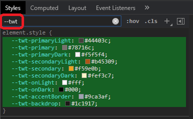

# How do it know?

Ever heard the joke about the thermos keeping **"hot things hot"**,
and **"cold thing cold"?** The confused bystander asked: **"How do it
know?"**

You may be wondering how **tw-themes** implements the dynamic color mapping
of **real colors** to **context colors?**

_While this is an internal implementation detail_, the simple answer is:
**CSS Variables** _({{book.ext.cssVars}})_.

- All tailwind context colors reference **CSS Variables**, for example:

  ```js
  tailwind.config.js
  ==================
    ... snip snip
    colors: { // ... OUTPUT from: TwThemes.colorConfig()
      primary:  "var(--twt-primary)",
      ... snip snip
    }
  ```

- When you change your theme _(at run-time)_ these **CSS Variables** are set
  in the `<body>` tag _(sourced from the theme's real color)_:

  ```html
  <body style="--twt-primary: #B91C1C;">
  ```

You can actually see this in your browser's dev tools.  Simple filter
the Styles section with "--twt" _(the prefix used for all **tw-themes** CSS
Variables)_:

<p align="center"></p>

If you change your theme, you will see these colors change.
