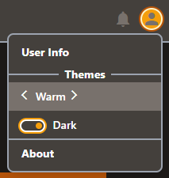

# See It Live

Want to see a real **tw-themes** app?

{{book.ext.snfGithub}} is the project _where **tw-themes** was
conceived_.  It is a {{book.ext.svelte}} utility providing form
validation, and contains a {{book.ext.snfDemoApp}} illustrating
various samples.  <mark>Here is a live demo:</mark>

<!-- *** embedded app *** -->
<p align="center">
  <iframe name="snfApp"
          id="snfApp"
          width="700"
          height="394"
          src="https://svelte-native-forms.js.org/app/"
          frameborder="0"></iframe>
</p>

For the purposes of demonstrating **tw-themes**, we are merely focused
on changing the active theme ... _found the upper right dropdown
menu_:

<p style="text-align: center;">
  
</p>

You can select your "theme color", and toggle "Dark Mode"
... <mark>try it (in the live demo above)</mark>.

From a "theme coding" perspective, there are only a few modules of
interest:

1. {{book.ext.snf_colorTheme_js}}

   This is the primary module that promotes our {{book.api.TwThemes}}
   object, through the {{book.api.initTwThemes}} invocation, fusing
   the relationship between our {{book.api.Schema}} and
   {{book.api.Themes}}.

   - The {{book.api.Schema}} is defined as follows:
  
     ```js
     const schema = [
       'primaryLight',
       'primary',
       'primaryDark',
  
       'secondaryLight',
       'secondary',
       'secondaryDark',
  
       'onLight',       // typically black
       'onDark',        // typically white
  
       'accentBorder',  // typically a gray tone (e.g. 'coolGray-600')
                        // ... used for borders in SideBar/NavBar/Menu/Dialog/etc.
  
       'backdrop',      // universal background 
                        // ... can be a gray tone       (e.g. 'coolGray-200')
                        // ... or lighter primary shade (e.g. `${primary}-100`)
                        //     ... lighter that 'primaryLight'
                        //         providing NOT too much of same color
     ];
     ```
  
   - Our {{book.api.Themes}} are defined as follows:
  
     ```js
     const themes = {
       'Warm': { contextColors: gen('warmGray', 'amber'), },
       'Cool': { contextColors: gen('coolGray', 'orange'), },
       'Mono': {
         contextColors: {
           ...gen('coolGray', 'red'), // ... base colors
           'primaryLight':   'white', // ... overrides:
           'primaryDark':    'black',
           'backdrop':       'white',
         }
       },
       'Amber':   { contextColors: gen('amber',  'indigo'), },
       'Teal':    { contextColors: gen('teal',   'rose'),   },
       'Cyan':    { contextColors: gen('cyan',   'orange'), },
       'Indigo':  { contextColors: gen('indigo', 'amber'), },
     };
     ```
  
   - Notice that we utilize a helper function that generates the
     default contextColors _(which can be overridden)_:
  
     ```js
     function gen(primary, secondary) {
       return {
         'primaryLight':   `${primary}-300`,
         'primary':        `${primary}-500`,
         'primaryDark':    `${primary}-900`,
     
         'secondaryLight': `${secondary}-300`,
         'secondary':      `${secondary}-500`,
         'secondaryDark':  `${secondary}-900`,
     
         'onLight':        'black',
         'onDark':         'white',
     
         'accentBorder':   'coolGray-600',
     
         'backdrop':       `${primary}-100`, // or: 'coolGray-200'
       };
     }
     ```
  
   - Finally, we invoke {{book.api.initTwThemes}} and promote the
     {{book.api.TwThemes}} object through an export.
  
     ```js
     const initialThemeName   = 'Warm'; // AI: ENHANCE TO pull from local storage
     const initialInvertShade = true;   //     ditto
     
     const TwThemes = initTwThemes(schema, themes, initialThemeName, initialInvertShade);
     export default TwThemes;
     ```

1. {{book.ext.snf_ThemeSelector_svelte}}

   The `<ThemeSelector>` component is an **extremely simple solution**
   to changing the theme.  It merely invokes the
   {{book.api.activatePriorTheme}} / {{book.api.activateNextTheme}}
   functions on the arrow clicks.

   While I don't expect you to be a svelte user, the relevant code
   snippets are:

   ```html
   <script>
     import TwThemes  from './colorTheme';
   </script>

   <span>
   
     <Icon name="arrow_back_ios"
           ... snip snip
           on:click={() => theme = TwThemes.activatePriorTheme()}/>
   
     {theme}
   
     <Icon name="arrow_forward_ios"
           ... snip snip
           on:click={() => theme = TwThemes.activateNextTheme()}/>
   </span>
   ```

   **Easy Peasy**!

1. {{book.ext.snf_ThemeInversionSelector_svelte}}

   The `<ThemeInversionSelector>` component is an **equally simple
   solution** to changing the theme's dark mode.

   It merely invokes the {{book.api.toggleInvertShade}} function.

1. {{book.ext.snf_tailwind_config_js}}

   Of course, we communicate our {{book.guide.contextColors}} to
   **tailwind** through `TwThemes`'s {{book.api.colorConfig}}
   function:

   **`tailwind.config.js`**
   ```js
   export default {
     ... snip snip
     theme: {
       extend: {
         colors: TwThemes.colorConfig(),
       },
     },
     ... snip snip
   };
   ```

1. Lastly, the **html markup** found throughout the project is
   utilizing the context colors defined by our app.

   ```html
   <span class="text-onLight hover:bg-primary hover:text-onDark ... snip snip">
     That's All Folks :-)
   </span>
   ```
